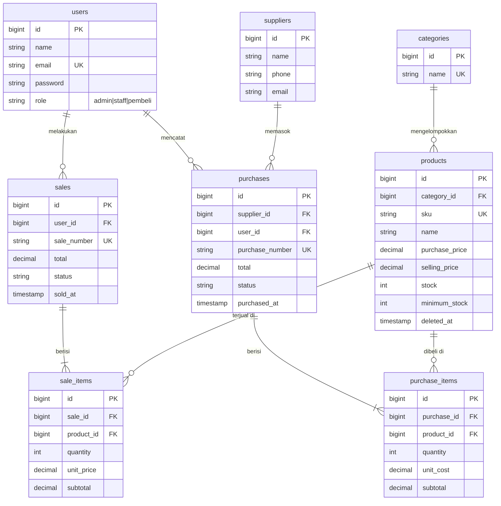

# ERD My Apotik

```mermaid
erDiagram
    users ||--o{ sales : "melakukan"
    users ||--o{ purchases : "mencatat"
    categories ||--o{ products : "mengelompokkan"
    suppliers ||--o{ purchases : "memasok"
    sales ||--|{ sale_items : "berisi"
    purchases ||--|{ purchase_items : "berisi"
    products ||--o{ sale_items : "terjual di"
    products ||--o{ purchase_items : "dibeli di"

    users { bigint id PK
        string name
        string email UK
        string password
        string role "admin|staff|pembeli" }
    categories { bigint id PK
        string name UK }
    suppliers { bigint id PK
        string name
        string phone
        string email }
    products { bigint id PK
        bigint category_id FK
        string sku UK
        string name
        decimal purchase_price
        decimal selling_price
        int stock
        int minimum_stock
        timestamp deleted_at }
    purchases { bigint id PK
        bigint supplier_id FK
        bigint user_id FK
        string purchase_number UK
        decimal total
        string status
        timestamp purchased_at }
    purchase_items { bigint id PK
        bigint purchase_id FK
        bigint product_id FK
        int quantity
        decimal unit_cost
        decimal subtotal }
    sales { bigint id PK
        bigint user_id FK
        string sale_number UK
        decimal total
        string status
        timestamp sold_at }
    sale_items { bigint id PK
        bigint sale_id FK
        bigint product_id FK
        int quantity
        decimal unit_price
        decimal subtotal }
```
